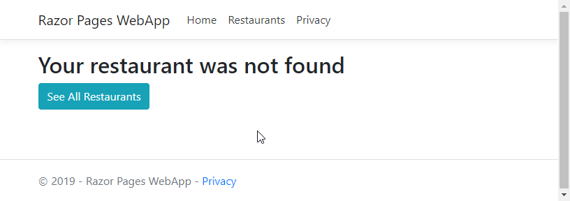

# 3.ModelsModelBinding
Der oprettes en mulighed for at søge (første del af navnet og case-sensitivt):  


&nbsp;

### ServiceLayer

*RestaurantService* udvides med en metode, der kan tage imod en søgeparameter:
```c#
public interface IRestaurantService
{
    IQueryable<Restaurant> GetRestaurants();
    IQueryable<Restaurant> GetRestaurantsByName(string name = null);
}
```

Her er implementationen i servicen:
```c#
public IQueryable<Restaurant> GetRestaurantsByName(string name = null)
{
    return _ctx.Restaurants
        .Where(r => string.IsNullOrEmpty(name) || r.Name.StartsWith(name))
        .OrderBy(r => r.Name);
}
```

&nbsp;

### WebApp
Tilføj en searchbox til List view. Med BootStrap 4 laves en searchbox således:
```html
<form method="get">
    <div class="input-group mb-3">
        <input type="search" asp-for="SearchTerm" class="form-control">
        <div class="input-group-append">
            <button class="btn btn-outline-secondary" type="submit">
                <i class="fas fa-search"></i>
            </button>
        </div>
    </div>
</form>
```

Bemærk at der er linket til CSS-filen fra *Font Awesome* i `_Layout`.
Man kan evt. demonstrere en `input` uden brug af `asp-for`, der så vil kræve både `id`, `name` og `value`:
```html
<input type="search" id="SearchTerm" name="SearchTerm" value="@Model.SearchTerm">
```

Her ses ***PageModel***:
```c#
public class ListModel : PageModel
{
    public IEnumerable<Restaurant> Restaurants { get; set; }
 
    [BindProperty(SupportsGet = true)]
    public string SearchTerm { get; set; }
 
    private readonly IRestaurantService _restaurantService;
 
    public ListModel(IRestaurantService restaurantService)
    {
        _restaurantService = restaurantService;
    }
 
    public void OnGet()
    {
        Restaurants = _restaurantService.GetRestaurantsByName(SearchTerm);
    }
}
```

Bemærk at der laves en *TwoWay Databinding* ved at tilføje ```[BindProperty]``` til *SearchTerm*. Og at den bringes til at supportere `GET`.

Man man også vise to andre (og mindre smarte) måder:
Uden Model Binding:
```c#
string searchTerm = HttpContext.Request.QueryString.Value.Split('=').LastOrDefault();
```
One-Way binding via parameter:
```C#
public void OnGet(string searchTerm)
{
    Restaurants = _restaurantService.GetRestaurantsByName(searchTerm).ToList();
}
```

&nbsp;

## Detail Page
### ServiceLayer
Tilføj  ```GetRestarantById(int)``` til RestaurantService:
```c#
public Restaurant GetRestaurantById(int restaurantId)
{
    return _ctx.Restaurants.Find(restaurantId);
}
```

&nbsp;

### WebApp
Opret en Razor Page kaldet **Detail** i Restaurant-folderen.
```html
@page
@model WebApp.Pages.Restaurants.DetailModel
@{
    ViewData["Title"] = "Detail";
}
 
<h2>@Model.Restaurant.Name</h2>
 
<div>
    Id: @Model.Restaurant.Id
</div>
<div>
    Location: @Model.Restaurant.Location
</div>
<div>
    Cuisine: @Model.Restaurant.Cuisine
</div>
 
<a asp-page="./List" class="btn btn-info">All Restaurants</a>
```

PageModel:
```c#

public class DetailModel : PageModel
{
    public Restaurant Restaurant { get; set; }
 
    private readonly IRestaurantService _restaurantService;
 
    public DetailModel(IRestaurantService restaurantService)
    {
        _restaurantService = restaurantService;
    }
 
    public void OnGet(int restaurantId)
    {
        Restaurant = _restaurantService.GetRestaurantById(restaurantId);
    }
}
```

Tilføj ikon med link til List pagen:
```html
<table class="table">
    @foreach (var restaurant in Model.Restaurants)
    {
    <tr>
        <td>@restaurant.Name</td>
        <td>@restaurant.Location</td>
        <td>@restaurant.Cuisine</td>
        <td>
            <a asp-page="./Detail" asp-route-restaurantId="@restaurant.Id">
                <i class="fas fa-info-circle"></i>
            </a>
        </td>
    </tr>
    }
</table>
```

Tilføjelse af **Route** i toppen af Details.cs:
```html
@page "{restaurantId:int}"
```
Hvilket giver en URL: **Restaurants/Detail/3** i stedet for Restaurants/Detail?restaurantId=3

&nbsp;

#### Håndtering af Bad Requests
Hvis brugeren ændrer URL’en til et ID, der ikke findes, så kastes en exception. Dette skal undgås.
Først oprettes en **NotFound.cshtml** page (uden PageModel):
```html
@page
@{
    ViewData["Title"] = "NotFound";
}
 
<h2>Your restaurant was not found</h2>
<a asp-page="./List" class="btn btn-info">See All Restaurants</a>
Der laves en control i OnGet() og returntypen ændres til IActionResult:
public IActionResult OnGet(int restaurantId)
{
    Restaurant = _restaurantService.GetRestaurantById(restaurantId);
 
    if (Restaurant == null)
    {
        return RedirectToPage("./NotFound");
    }
    return Page();
}
```  


   
Når URL’ens id ændres til 4:
  
 